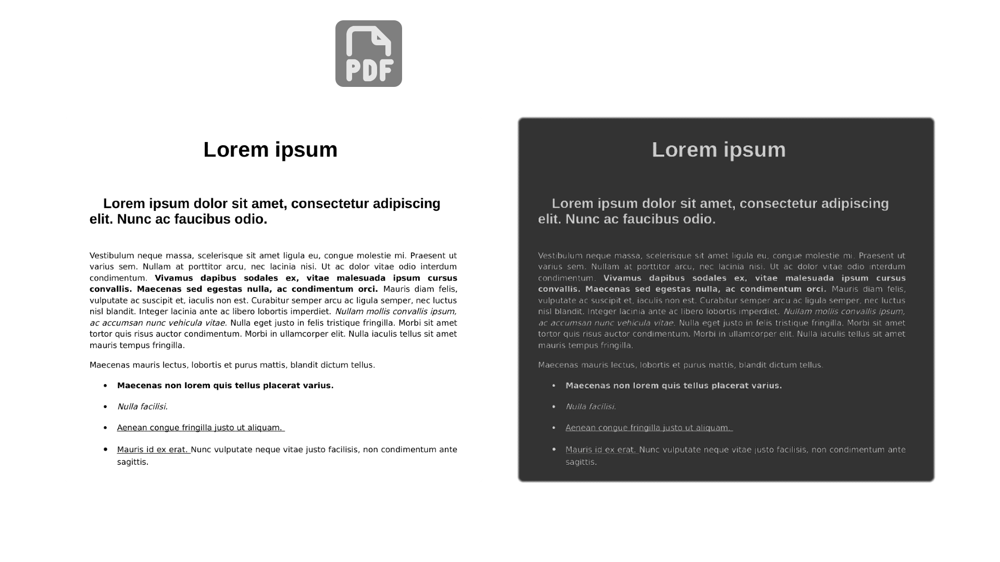

# Night PDF

This repository hosts the source code for the Night PDF extension, a simple browser extension that applies a dark theme to your PDF viewer.

  

This extension is a fork of [PDF Dark Theme][pdf-dark-theme-link] by [Chris Straka][chris-straka-link] with some extra functionality, specifically:

- Toggling between multiple dark themes by clicking the extension icon
- Works on local and online PDFs

## Using and Customising the Extension

To use the extension, [download and install the extension](https://dev.to/ben/how-to-install-chrome-extensions-manually-from-github-1612 "Learn how to download and install extensions from GitHub.")
using Developer Mode (this extension is not available via the Chrome Web Store or other extension websites).

To customise the dark themes, simply modify the [colours in the `backgroundColours` array](https://github.com/anipalur/night-pdf/blob/7d86f591c2405b5ff59bddb5f698cc8973b7ab56/content-script.js#L9 "View the colours in the backgroundColours array.") in content-script.js.

## Attribution

- Thank you to [Chris Straka][chris-straka-link] for his original [PDF Dark Theme][pdf-dark-theme-link] extension!
- Thank you to [Tabler Icons](https://tabler.io/icons "Learn more about Tabler Icons.") for the Night PDF icon!
- Thank you to [File Examples](https://file-examples.com "Learn more about File Examples.") for the sample PDF shown in the cover image.

## Licences

**Copyright &copy; 2025 Anitej Palur**  
The source code for this extension is licensed under a [GNU GPLv3 License](https://www.gnu.org/licenses/gpl-3.0.html "Learn more about the GNU GPLv3 License.").

See [LICENSE](/LICENSE "View the LICENSE file.") for more information.

[pdf-dark-theme-link]: https://github.com/chris-straka/pdf-dark-theme "View the PDF Dark Theme GitHub repository."
[chris-straka-link]: https://cstraka.dev "Learn more about Chris Straka."
